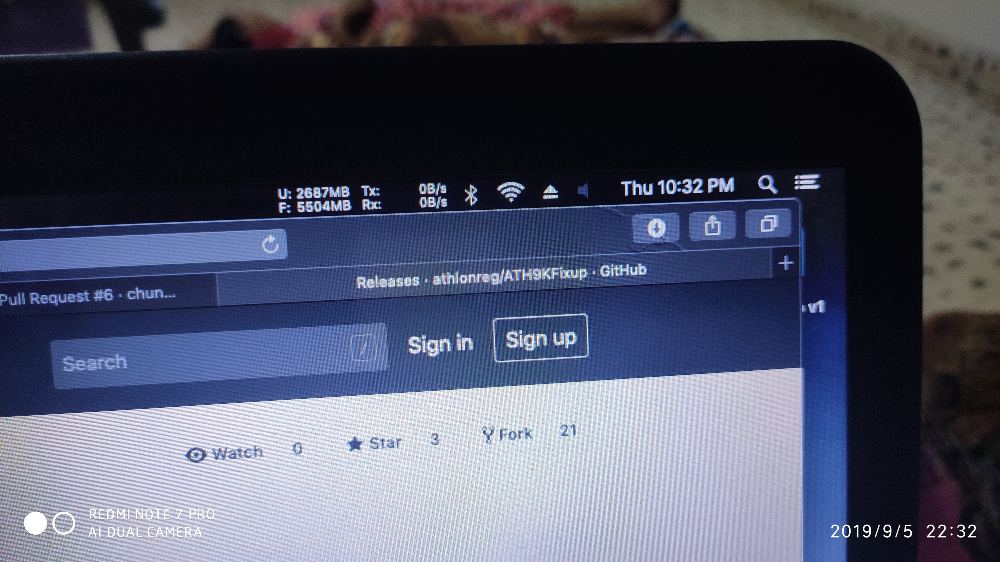

# HP-15d002TX-Hackintosh
Guide to install macOS Mojave on HP 15d002TX

# Status
Everything working except Intel wireless LAN. The installation was super easy. I have used Lilu and Whatevergreen kext for Intel hd graphics. AppleALC for audio.

# Screenshot

# Pro tips
Everything working except Audio and Ethernet. The installation was super easy.

I have used config_HD4000_1366x768.plist for base plist it is found here

I have used Lilu and Whatevergreen kext for Intel HD graphics 4000.

For WiFi, I have used ATH9KFixup.kext with boot args -ath9565 Link: https://github.com/athlonreg/ATH9KFixup

The touchpad works, but not showing in the system preference->Trackpad.