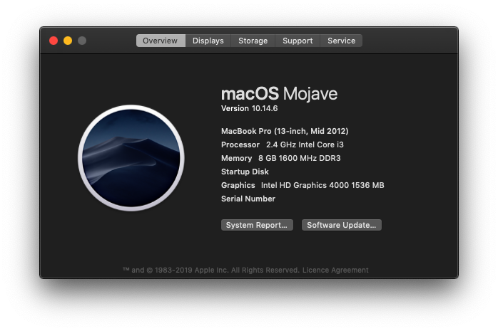
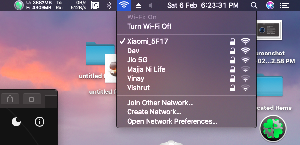
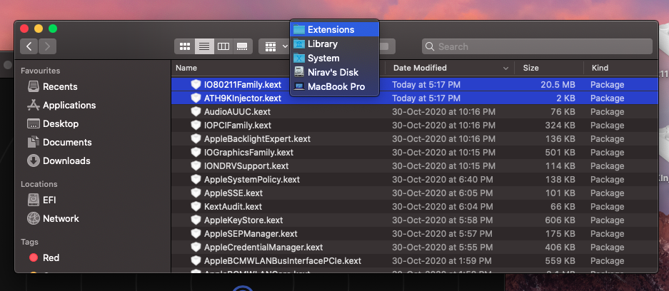

 
 
 
 

# HP-15d002TX-Hackintosh
Guide to install macOS Mojave on HP 15d002TX

# Status
Everything working except Intel wireless LAN. The installation was super easy. I have used Lilu and Whatevergreen kext for Intel hd graphics. AppleALC for audio.

# Screenshot

# Tips
Everything working except Audio and Ethernet. The installation was super easy.

I have used config_HD4000_1366x768.plist for base plist it is found here

I have used Lilu and Whatevergreen kext for Intel HD graphics 4000.

## WiFi

For WiFi, I have used ATH9KFixup.kext with boot args -ath9565 Link: https://github.com/athlonreg/ATH9KFixup

The `IO80211Family.kext` and `ATH9KInjector.kext` should be replaced in `S/L/E`, then you have to rebuild kext cache. See the release section to get `IO80211Family.kext` and `ATH9KInjector.kext`.

The touchpad works, but not showing in the system preference->Trackpad.

## Credits
 - [Apple](https://www.apple.com) for macOS.
 - [Acidanthera](https://github.com/acidanthera) for most of the kexts.
 - [goodwin](https://github.com/goodwin) for ALCPlugFix.
 - [RehabMan](https://github.com/RehabMan) for some patches.
 - [Steve Zheng](https://github.com/stevezhengshiqi) for some patches.
 - [Sniki](https://github.com/Sniki) for some patches.
 - [daliansky](https://github.com/daliansky) for some patches.
 - [Moh_Ameen](https://github.com/ameenjuz) for some patches.
 - [al3xtjames](https://github.com/al3xtjames) for clover-theme-oss theme.
 - [ImmersiveX](https://github.com/ImmersiveX) for clover-theme-minimal-dark theme.
 - And anyone else that helped to develop and improve hackintoshing.
